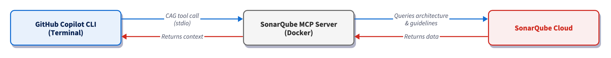

# Harnessing Sonar Context Augmentation with GitHub Copilot CLI

## TL;DR overview

* GitHub Copilot CLI receives project-specific awareness through Sonar Context Augmentation via the SonarQube MCP Server; generated code adheres to your project's structure without excessive prompt engineering.
* Context Augmentation assists terminal-driven Copilot workflows where there's no editor UI in the loop.
* Code generated with SonarQube Cloud context is more likely to follow your team's conventions and less likely to introduce quality-gate violations and PR blockages.
* Implementation involves two files (`mcp-config.json` and `copilot-instructions.md`) that together make architecture and guideline lookups automatic with every CLI prompt.

[AI coding agents](https://www.sonarsource.com/resources/library/what-is-an-ai-agent/) interpret each prompt with a limited view of your codebase and often miss important architectural patterns and coding conventions. [Sonar Context Augmentation](https://docs.sonarsource.com/sonarqube-cloud/analyzing-source-code/context-augmentation) supplies these agents with the context they need to remain compliant with your project's structure and standards. It connects the agent to your [SonarQube Cloud](https://docs.sonarsource.com/sonarqube-cloud) analysis through the [SonarQube MCP Server](https://docs.sonarsource.com/sonarqube-mcp-server), surfacing architecture, class hierarchies, call flows, and project-specific guidelines. The agent consults those tools before generating code, so that prompts produce framework-correct code on the first try.

This blueprint details the configuration for [GitHub Copilot CLI](https://github.com/features/copilot/cli), the terminal-based Copilot agent. It explores the Guide stage of the [Agent Centric Development Cycle](https://www.sonarsource.com/blog/the-future-is-ac-dc-the-agent-centric-development-cycle/) and uses [Microsoft's GCToolKit](https://github.com/microsoft/gctoolkit) (a Java library for GC log analysis) as the demo project.

## When to use this

- Your project's conventions live above the file level and a single-file context window can't surface them. You want Copilot CLI to pull that context from SonarQube Cloud before it generates anything.
- You drive Copilot from the terminal rather than an IDE, so there's no editor agent-mode UI reviewing each suggestion before it lands on disk.

## What you'll achieve

- SonarQube MCP Server registered in the GitHub Copilot CLI's `mcp-config.json` and configured for Context Augmentation
- A `copilot-instructions.md` directive that triggers architecture and guideline tool calls before code is generated
- A working Context Augmentation flow (query architecture, fetch guidelines, generate context-aware code) running in the terminal, producing code that fits your project's patterns from the start

## Architecture



The SonarQube MCP Server runs as a Docker container with your workspace mounted at `/app/mcp-workspace` and communicates with the CLI over stdio. When a Context Augmentation tool call fires, the CLI sends it to the MCP server over stdio, which in turn queries SonarQube Cloud's API for architecture data, quality rules, and coding guidelines. SonarQube Cloud returns that analysis data to the MCP server, which packages it as context and passes it back to the CLI, at which point Copilot generates code that fits the project's actual structure and standards.

## Prerequisites

- **GitHub Copilot CLI** installed and authenticated
- An active GitHub Copilot subscription
- [**SonarQube Cloud**](https://www.sonarsource.com/products/sonarqube/cloud/) on a [Team or Enterprise plan](https://www.sonarsource.com/plans-and-pricing/sonarcloud/) with Context Augmentation enabled
- A completed CI scan (after you have enabled Context Augmentation)
- **Docker** up and running
- A SonarQube Cloud **user token**. Create one under **My Account > Security** on SonarQube Cloud. If Context Augmentation was recently enabled, generate a fresh token as older tokens may not carry the required permissions.
- Use of a supported programming language. For full architectural awareness, use [Java](https://www.sonarsource.com/knowledge/languages/java/). Partial support (architecture tools) exists for [C#](https://www.sonarsource.com/knowledge/languages/csharp/), [Python](https://www.sonarsource.com/knowledge/languages/python/), [JavaScript](https://www.sonarsource.com/knowledge/languages/js/), and [TypeScript](https://www.sonarsource.com/knowledge/languages/ts/), but guidelines work with all [programming languages](https://www.sonarsource.com/knowledge/languages/) supported by SonarQube Cloud.

**Demo project:** to follow along with this guide, first fork [microsoft/gctoolkit](https://github.com/microsoft/gctoolkit) to your GitHub account, import it into SonarQube Cloud with CI-based analysis enabled, and clone it locally. GCToolKit is a multi-module Java project with class hierarchies, call flows, and ServiceLoader-based wiring patterns that exercise Context Augmentation's capabilities.

## Step 1 — Register the SonarQube MCP Server with the CLI

The Copilot CLI reads MCP server registrations from `~/.copilot/mcp-config.json`. If the file doesn't already exist, create the directory and open it in your editor.

Paste in the following configuration:

```json
{
  "mcpServers": {
    "sonarqube": {
      "command": "docker",
      "args": [
        "run", "-i", "--rm", "--init", "--pull=always",
        "-e", "SONARQUBE_TOKEN",
        "-e", "SONARQUBE_ORG",
        "-e", "SONARQUBE_PROJECT_KEY",
        "-v", "<ABSOLUTE_PATH_TO_YOUR_PROJECT>:/app/mcp-workspace:rw",
        "mcp/sonarqube"
      ],
      "env": {
        "SONARQUBE_ORG": "<YourOrganizationKey>",
        "SONARQUBE_PROJECT_KEY": "<YourProjectKey>"
      }
    }
  }
}
```

Replace the three placeholder values:

- `<ABSOLUTE_PATH_TO_YOUR_PROJECT>` — the full path to your project on disk (for example, `/Users/dev/gctoolkit`). Docker requires absolute paths; relative paths like `./` fail silently.
- `<YourOrganizationKey>` — your SonarQube Cloud organization key.
- `<YourProjectKey>` — your SonarQube Cloud project key, found on the **Project Information** page in SonarQube Cloud or in `sonar-project.properties`.

If you work across multiple SonarQube Cloud projects, note that the values above bind the server to *one* such project. To avoid configuring `~/.copilot/mcp-config.json` for every project, place the same config at `<your-project>/.mcp.json` instead and Copilot CLI auto-loads this workspace-scoped config (same `mcpServers` schema) when launched from anywhere inside the project. Keep in mind that `.copilot/mcp-config.json` at the project root is *not* a recognized path; only `.mcp.json` works for the workspace config. If you'd rather keep the workspace clean, set [`COPILOT_HOME`](https://docs.github.com/en/copilot/reference/copilot-cli-reference/cli-config-dir-reference) per-shell to a project-specific directory containing an `mcp-config.json`; the CLI then reads `$COPILOT_HOME/mcp-config.json` instead of the global config.

In our implementation, `SONARQUBE_TOKEN` is intentionally absent from the `env` block. Export it in your shell so Docker forwards it via the `-e SONARQUBE_TOKEN` arg without committing the token to a config file:

```shell
export SONARQUBE_TOKEN="<YourSonarQubeUserToken>"
```

Add the export line to `~/.zshrc` or `~/.bashrc` so it persists across CLI sessions. Keep in mind that the token must be a SonarQube Cloud **user token**.

The above config does not set `SONARQUBE_TOOLSETS` as the SonarQube MCP Server enables many toolsets by default (including Context Augmentation). If you ever want to restrict the server to a subset of these tools, set `SONARQUBE_TOOLSETS` explicitly to a comma-separated list.

For SonarQube Cloud in the US region, add `-e`, `"SONARQUBE_URL"` to the `args` and `"SONARQUBE_URL": "https://sonarqube.us"` to the `env` block. EU-region users do not need to set `SONARQUBE_URL`.

One more thing to watch out for: if you've used the SonarQube MCP Server in VS Code, the Copilot CLI uses an `mcpServers` wrapper at the top level of the config file, while VS Code's `.vscode/mcp.json` uses `servers`. The two schemas are not interchangeable; the CLI expects `mcpServers` at the top level and a servers-wrapped config will register *no* servers.

## Step 2 — Verify the MCP connection

Navigate to your local project's root (the same path used in the `-v` mount) and launch the CLI:

```shell
cd ~/path/to/gctoolkit
copilot
```

Inside the CLI, list the registered MCP servers:

```
/mcp show
```

The `sonarqube` server should appear in the list.

Then check that the SonarQube MCP Server tools are loaded:

```
/mcp show sonarqube
```

With Context Augmentation enabled, the output should include `get_current_architecture`, `get_guidelines`, `search_by_signature_patterns`, `search_by_body_patterns`, `get_source_code`, `get_type_hierarchy`, `get_upstream_call_flow`, `get_downstream_call_flow`, `get_references`, `check_dependency`, `run_advanced_code_analysis`, and `show_rule`.

Perform two sanity checks to confirm the integration is working.

**Architecture query:**

```
What is the current architecture of this project?
```

You should see a `get_current_architecture` tool call, followed by GCToolKit's module hierarchy: `api`, `integration`, `parser`, `sample`, and `vertx`.

**Guidelines query:**

```
What are the coding guidelines for this project?
```

Copilot CLI should invoke `get_guidelines` and return rules derived from your project's SonarQube Cloud analysis: naming conventions, security policies, maintainability standards, etc.

If you encounter "UDG not loaded" instead of architecture data, the branch hasn't been analyzed via CI yet; trigger a CI scan and try again.

## Step 3 — Add GUIDE directives

Copilot CLI now has access to Context Augmentation tools, but it won't necessarily call them unprompted. A `.github/copilot-instructions.md` file at the repo root tells the agent when and how to use these tools. The CLI knows to auto-load this file when launched from anywhere inside the repository, per the [custom instructions docs](https://docs.github.com/en/copilot/how-tos/copilot-cli/customize-copilot/add-custom-instructions). The CLI also reads your `AGENTS.md`, `CLAUDE.md`, or `GEMINI.md` from the repo root if they exist.

If you haven't already, create the file and supply the following directives:

```
# Sonar Context Augmentation directives

## Before generating or modifying code

- Call `get_guidelines` to retrieve project-specific coding standards and quality rules. Apply these guidelines to all generated code.
- Call `get_current_architecture` to understand the project's module structure and component relationships before making structural changes.
- Use `search_by_signature_patterns` or `search_by_body_patterns` to locate existing implementations before creating new classes or methods. Follow established patterns.

## Before structural changes

- Call `get_intended_architecture` to check for user-defined architectural constraints.
- Use `get_upstream_call_flow` and `get_downstream_call_flow` to trace the impact of changes through the call graph.
- Call `get_references` to identify all inbound and outbound dependencies for any class or module being modified.
- Call `get_type_hierarchy` to understand inheritance relationships before adding new subclasses or implementations.

## Before adding or updating dependencies

- Call `check_dependency` with the Package URL (purl) to verify the dependency is free of known vulnerabilities, malware, and license issues.

## After modifying code

- Use `show_rule` to look up details for any SonarQube rule violations flagged during analysis.
```

Be as specific as possible here. A directive like "examine the code" is too vague to trigger a specific tool call; naming the exact tools (`get_guidelines`, `get_type_hierarchy`, etc.) produces consistent behavior.

The [official Context Augmentation docs](https://docs.sonarsource.com/sonarqube-cloud/analyzing-source-code/context-augmentation) include a deeper, combined Guide-and-Verify directive template that also integrates [Agentic Analysis](https://docs.sonarsource.com/sonarqube-cloud/analyzing-source-code/agentic-analysis) for the Verify stage.

## Step 4 — Generate code with Context Augmentation

With the directives in place, test the full flow. Ask Copilot CLI to generate code that depends on project-specific patterns. You don't need to mention architecture or guidelines in the prompt; the directive file should trigger those lookups on its own.

```
Add a new class to the sample module that takes a GC log path on the
command line, runs analysis using the existing aggregations
(PauseTimeSummary, HeapOccupancyAfterCollectionSummary,
CollectionCycleCountsSummary), and prints a
unified summary to stdout. Follow the existing patterns in the project.
```

GCToolKit's `sample` module contains three `Summary` aggregations and a `Main` runner that wires them into a `JavaVirtualMachine` analysis. Our prompt asks the agent to add a sibling runner that takes a log path as a CLI argument and prints a combined report. Considering our pre-defined directives, Copilot CLI calls Context Augmentation tools to discover the consumer-side pattern before writing code:

1. **`get_guidelines`** retrieves project coding standards from SonarQube Cloud.
2. **`get_current_architecture`** maps the module structure and confirms `sample` as the target module.
3. **`search_by_signature_patterns`** locates the existing `Main` class so the new runner can follow the same shape.
4. **`get_source_code`** pulls `Main.java` to surface the `GCToolKit.analyze()` lifecycle and the `JavaVirtualMachine.getAggregation(Class)` retrieval pattern.
5. **`get_upstream_call_flow`** traces how `Aggregation` instances flow from the ServiceLoader into the analysis result, confirming `loadAggregationsFromServiceLoader()` as the canonical wiring step.
6. **`get_type_hierarchy`** confirms the public `Aggregation` interface and the three `Summary` types the runner needs to retrieve.

Copilot CLI then generates a single new Java file in the `sample` module:

**`GCReportCli.java`**:

```java
package com.microsoft.gctoolkit.sample;

import com.microsoft.gctoolkit.GCToolKit;
import com.microsoft.gctoolkit.io.GCLogFile;
import com.microsoft.gctoolkit.io.SingleGCLogFile;
import com.microsoft.gctoolkit.jvm.JavaVirtualMachine;
import com.microsoft.gctoolkit.sample.aggregation.CollectionCycleCountsSummary;
import com.microsoft.gctoolkit.sample.aggregation.HeapOccupancyAfterCollectionSummary;
import com.microsoft.gctoolkit.sample.aggregation.PauseTimeSummary;
import com.microsoft.gctoolkit.event.GarbageCollectionTypes;
import com.microsoft.gctoolkit.sample.collections.XYDataSet;

import java.io.IOException;
import java.io.PrintStream;
import java.nio.file.Files;
import java.nio.file.Path;

/**
 * CLI that analyzes a GC log file and prints a unified summary to stdout.
 * Usage: java -jar sample.jar /path/to/gc.log
 */
public class GCReportCli {

    public static void main(String[] args) throws IOException {
        String userInput = args.length > 0 ? args[0] : "";
        String gcLogFile = System.getProperty("gcLogFile", userInput);

        if (gcLogFile.isBlank()) {
            throw new IllegalArgumentException("GCReportCli requires a path to a GC log file.");
        }

        if (Files.notExists(Path.of(gcLogFile))) {
            throw new IllegalArgumentException(String.format("File %s not found.", gcLogFile));
        }

        GCReportCli cli = new GCReportCli();
        cli.run(gcLogFile, System.out);
    }

    public void run(String gcLogFile, PrintStream out) throws IOException {
        GCLogFile logFile = new SingleGCLogFile(Path.of(gcLogFile));
        GCToolKit gcToolKit = new GCToolKit();

        // Load aggregations via ServiceLoader as other samples do
        gcToolKit.loadAggregationsFromServiceLoader();

        JavaVirtualMachine machine = gcToolKit.analyze(logFile);

        out.println("=== GC Report Summary ===");

        // Pause time summary
        machine.getAggregation(PauseTimeSummary.class).ifPresent(pause -> {
            out.printf("Total pause time  : %.4f seconds%n", pause.getTotalPauseTime());
            out.printf("Percent pause time: %.2f%%%n", pause.getPercentPaused());
        });

        // Heap occupancy after collection
        machine.getAggregation(HeapOccupancyAfterCollectionSummary.class)
                .map(HeapOccupancyAfterCollectionSummary::get)
                .ifPresent(map -> {
                    out.println("--- Heap occupancy after collection ---");
                    for (Map.Entry<GarbageCollectionTypes, XYDataSet> e : map.entrySet()) {
                        out.printf("%s : %d samples%n", e.getKey(), e.getValue().size());
                    }
                });

        // Collection cycle counts
        Optional<CollectionCycleCountsSummary> counts = machine.getAggregation(CollectionCycleCountsSummary.class);
        counts.ifPresent(c -> {
            out.println("--- Collection cycle counts ---");
            c.printOn(out);
        });

        out.println("============================");
    }
}
```

Notice that the agent reused the `args[0]` plus `System.getProperty("gcLogFile", …)` validation pattern from `Main.java`, called the real `Summary` getters that `Main.java` revealed (`getTotalPauseTime()`, `getPercentPaused()`), and used `CollectionCycleCountsSummary.printOn(PrintStream)` rather than relying on a generic `toString()`. None of those API choices were included in the prompt; they came from the Context Augmentation discovery sequence. No `module-info.java` change is needed either as the new class is a consumer of the registered aggregations, not a new one.

Without Context Augmentation, the same prompt produces code that does not integrate with GCToolKit's framework. The agent has no way to know that `CollectionCycleCountsSummary` exposes a `printOn(PrintStream)` method instead of a useful `toString()`, naming that method without seeing the source is merely a guess. It has no way to know that `loadAggregationsFromServiceLoader()` is the canonical wiring step rather than manually instantiating each `Summary`. It has no way to know which package the new class belongs in or which event types each `Summary` cares about. The result is plausible-looking code that hardcodes a log path or reads from a `Scanner`, instantiates `Summary` classes by hand (so the registered aggregations never fire), and invents data-holder classes that don't match any real `Aggregation`. It might compile, but won't produce useful output. To reproduce the contrast, run `/mcp disable sonarqube` (or move `.github/copilot-instructions.md` aside) and re-issue the prompt.

## Verify the setup

You can confirm that Context Augmentation is in force when you see this sequence in the terminal after prompting Copilot CLI to produce code:

1. Tool-call traces appear for `get_guidelines` and `get_current_architecture` before any code is generated
2. Additional tool calls (`search_by_signature_patterns`, `get_source_code`, `get_upstream_call_flow`) appear as the agent locates and studies the existing runner
3. The generated class lands in the correct package and uses the real APIs, not invented ones

Two artifacts are configured during this workflow: `~/.copilot/mcp-config.json` (refer to Step 1) and `.github/copilot-instructions.md` (refer to Step 3).

## What to know

- Context Augmentation is in [open beta](https://docs.sonarsource.com/sonarqube-cloud/analyzing-source-code/context-augmentation); consult the [product release lifecycle](https://docs.sonarsource.com/sonarqube-cloud/appendices/product-release-lifecycle/) for more information.
- Context Augmentation is available in SonarQube Cloud currently, and not yet available in SonarQube Server.
- Requires a [Team or Enterprise plan](https://www.sonarsource.com/plans-and-pricing/sonarcloud/).
- The [embedded Cloud MCP endpoint](https://www.sonarsource.com/blog/announcing-native-mcp-server-in-sonarqube-cloud) does not currently support Context Augmentation because it has no filesystem access. The workspace volume mount requires the self-hosted Docker container.
- Docker requires an absolute path for the `-v` bind mount. Relative paths (`./`, `../`) will fail silently.
- If your GitHub organization has Copilot policies configured, an admin may need to enable MCP server access in the org's [Copilot settings](https://docs.github.com/en/copilot/how-tos/administer-copilot/manage-mcp-usage/configure-mcp-server-access).

## Next steps

- Add the Verify stage with [Agentic Analysis](https://docs.sonarsource.com/sonarqube-cloud/analyzing-source-code/agentic-analysis) so that your agent can analyze generated code against your quality gate before it reaches a PR.
- For alternative Context Augmentation implementations, see our companion blueprints for [Codex CLI](https://www.sonarsource.com/resources/library/get-started-with-sonar-context-augmentation-and-codex-cli/) and [Claude Code](https://www.sonarsource.com/resources/library/sonar-context-augmentation-claude-code/).
- Consult the official [Context Augmentation documentation](https://docs.sonarsource.com/sonarqube-cloud/analyzing-source-code/context-augmentation) for the complete reference on tools, supported languages, and configuration options.
